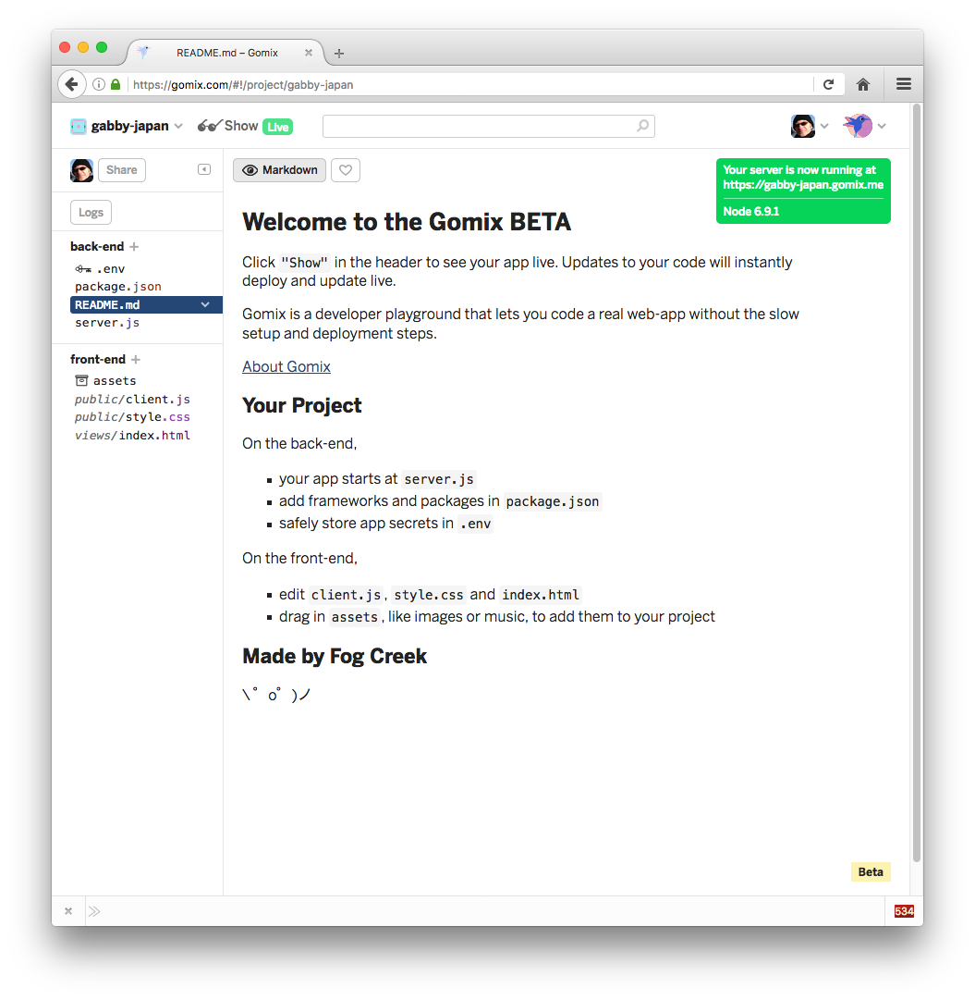

# Gomix Setup

If you do not have a github account, create one now:

- <https://github.com>

Now sign up for the gomix service:

- <https://gomix.com>

This will require you to log in using your github account.

Gomix will immediately display a starter project:

Press the `Show` button and it will reveal a live version of of the app you have just created:

You can interact with this repo by entering text in the Dreams box. Also, as this app is live in the cloud - and this is your own copy of the app - you can share this link with others. Do this now with someone next to you in the lab.

Verify that you each see different lists depending on what has been entered. Enter some 'dreams' into you someone else's app.
