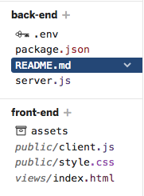
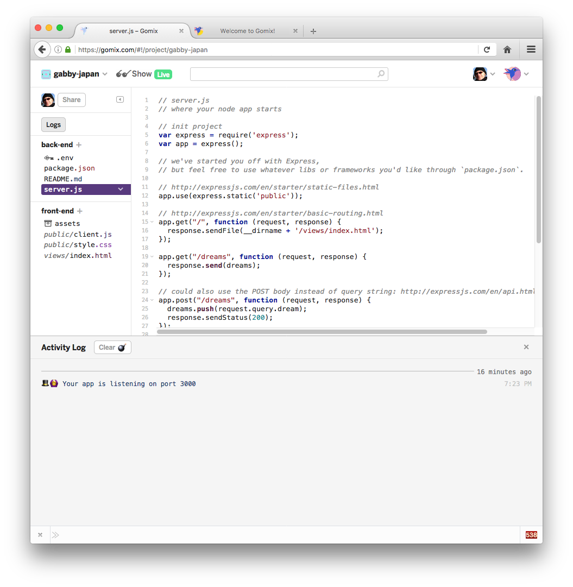
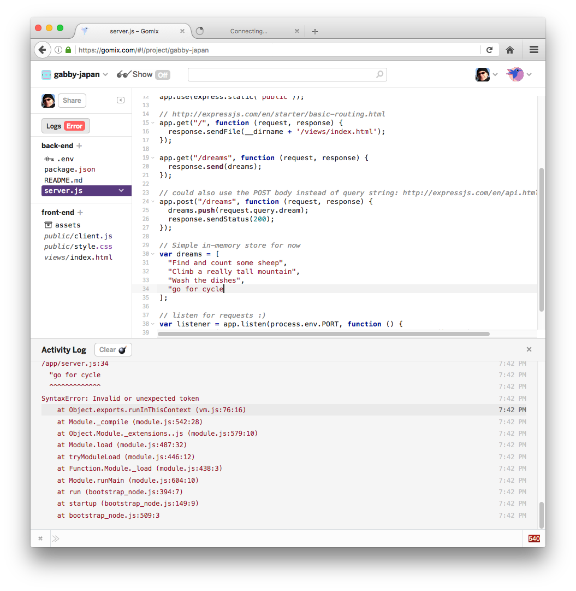
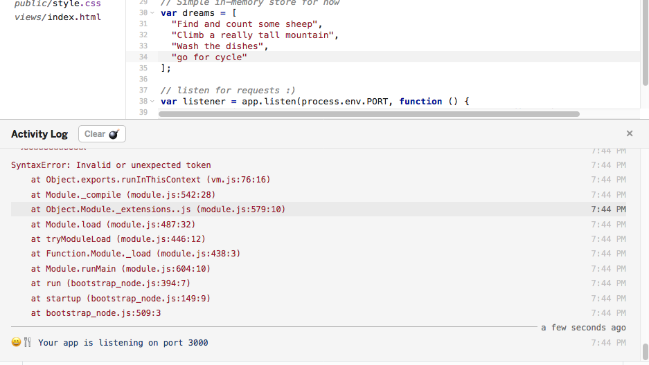

# Project Structure and Editing

Back in the `source` view, look at the project structure in more detail:

Select each of the files in turn and have a look at the contents. The css and html content will be familiar, but js will require some javascript knowledge we have yet to develop.

Any changes we make here will be directly published live to the cloud. For instance, open `index.html` and locate the following code:

~~~html
<main>
  
Oh hi,

  
Tell me your hopes and dreams:

  <form>
    <input type="text" maxlength="100" placeholder="Dreams!">
    <button type="submit">Submit</button>
  </form>
  <section class="dreams">
    <ul id="dreams">
    </ul>
  </section>
</main>
~~~

Make some changes to the text, eg:

~~~html

howdy

Tell me your plans for the weekend:

~~~

Verify that the changed text appears - both for you anyone you have shared this app with.

Looking at `server.js`, locate and modify some of the initial bullet items:

~~~JavaScript
// Simple in-memory store for now
var dreams = [
  "Find and count some sheep",
  "Climb a really tall mountain",
  "Wash the dishes"
];
~~~

Before making changes to this data, turn on logging first by pressing the `Logs` button.

This has reconfigured the view so we can see a new panel along the end of the browser.

As you make changes to `server.js`, you will see activity in this new panel.

In particular, you will see errors as you type - but if you complete a modification successfully, then the errors will be replaced with a standard `app listening` message:

