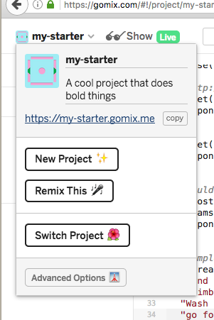
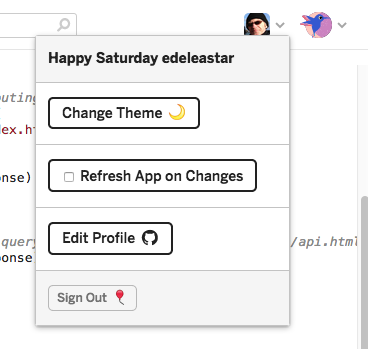
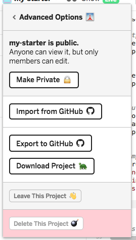
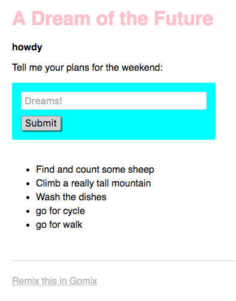

# Configuring the Project

The project name can be changed by directly entering a new name on the sidebar:

This will also change the project url, so if you have shared the app you will have to re-share the new url.

Another useful option is to disable the 'Refresh App on Changes' option:

Try this now. The behaviour of this feature can be a little confusing as the log may continue to report errors - but the live app itself will not be refreshed until you reenable the option.

Explore the advanced options:

Experiment with of all of these options.

For `Export to github`, the repository must already exist in your account. The project will, however, be on a different branch from master, so might not be visible at first unless you switch branches.

For `Download Project`, try the following:

- On your workstation, first install <https://nodejs.org> (select the latest LTS version).
- Edit the file `server.js`, changing the followling statements:

~~~js
// listen for requests :)
var listener = app.listen(process.env.PORT, function () {
  console.log('Your app is listening on port ' + listener.address().port);
});
~~~

to:

~~~js
// listen for requests :)
const listener = app.listen(process.env.PORT || 4000, function () {
  console.log('Your app is listening on port ' + listener.address().port);
});
~~~

- Download and unzip the download project.

- From a command shell, inside the project folder, run the following commands:
~~~bash
npm install
npm start
~~~

The latter command should display:

~~~
> my-gomix-app@0.0.1 start /Users/edeleastar/repos/modules/gomix/app
> node server.js

Your app is listening on port 4000
~~~

If you open a browser now on <http://localhost:4000> your application should be running locally:

