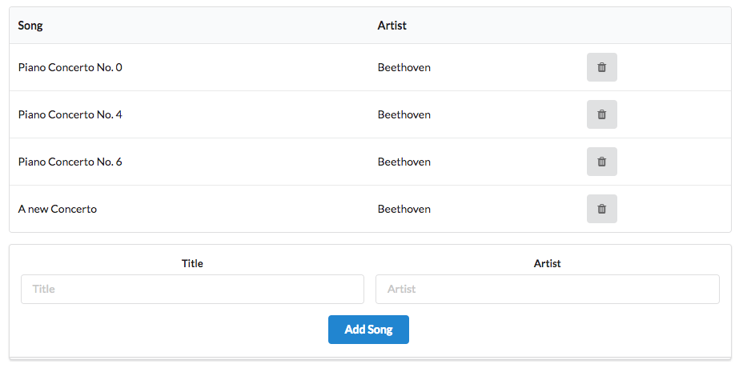
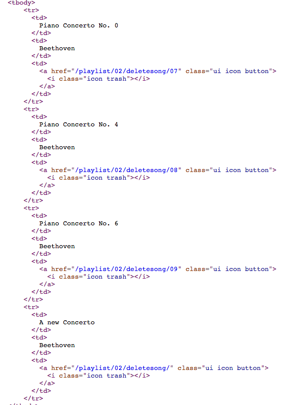

# ID Management

Deleting a song you have manually added using the form generates the following:

~~~
Cannot GET /playlist/02/deletesong/
~~~

However, pre-populated songs can still be deleted. What is going on here?

The issue is that the new songs we have added do not appear to have IDs. Looking at this list for instance:

Revealing the source:

Look at the last entry - there is no ID for the new song we added.

Here is our new `addsong` function again:

## controlers/paylist.js

~~~js
  addSong(request, response) {
    const playlistId = request.params.id;
    const playlist = playlistStore.getPlaylist(playlistId);
    const newSong = {
      title: request.body.title,
      artist: request.body.artist,
    };
    playlistStore.addSong(playlistId, newSong);
    response.redirect('/playlist/' + playlistId);
  },
~~~

The object we are inserting has only two fields:

~~~js
    const newSong = {
      title: request.body.title,
      artist: request.body.artist,
    };
~~~

We need to also insert a new, unique, ID for each object we create.

How do we create a new ID? This can be challenged in implement manually. However, one solution is to use Universally Unique Identifiers:

- <https://en.wikipedia.org/wiki/Universally_unique_identifier>

A library to generate a uuid is already in our app, we just need to import and use it

At the top of the `playlist` controller, we require the library:

## controllers/playlists.js
~~~
const uuid = require('uuid');
~~~

Now, when we are creating a playlist, we can use the library to generate a unique id for us:

~~~js
  const newSong = {
    id: uuid(),
    title: request.body.title,
    artist: request.body.artist,
  };
~~~

Try this now and make sure the new songs can be deleted. View the source to reveal the uuid-style ids the new songs have.
