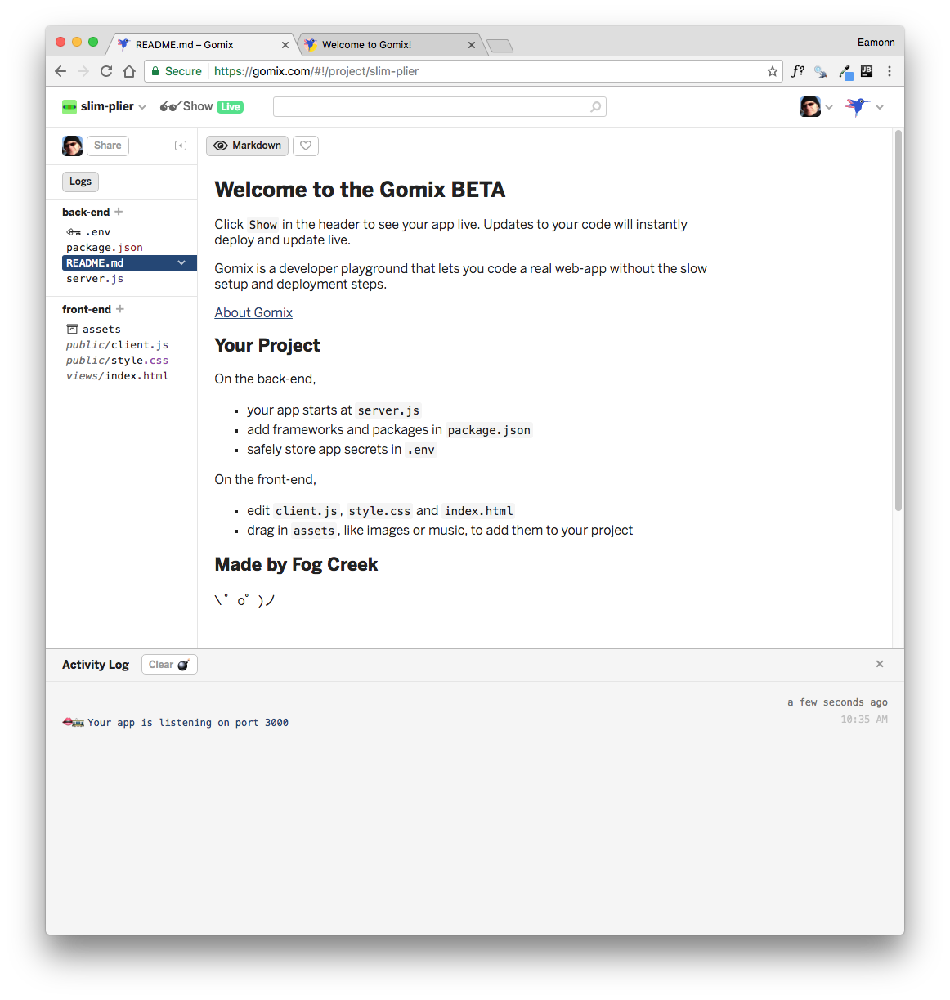
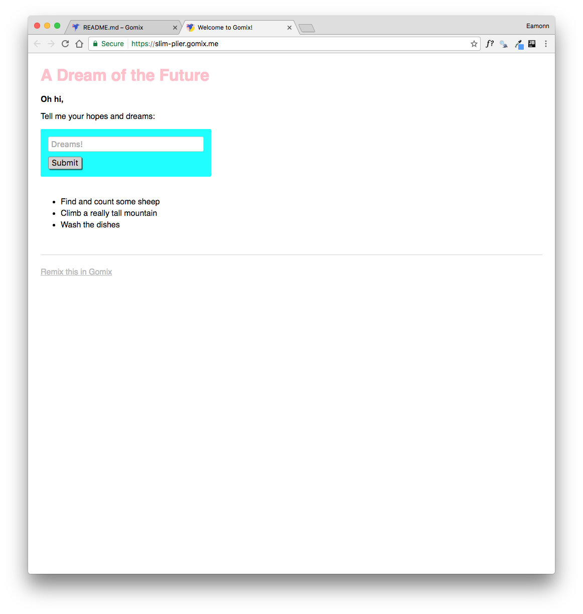
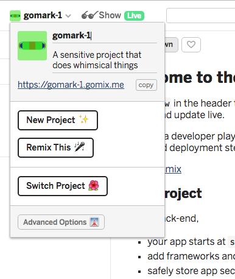
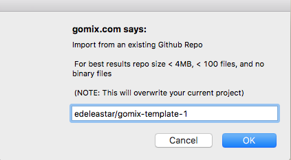
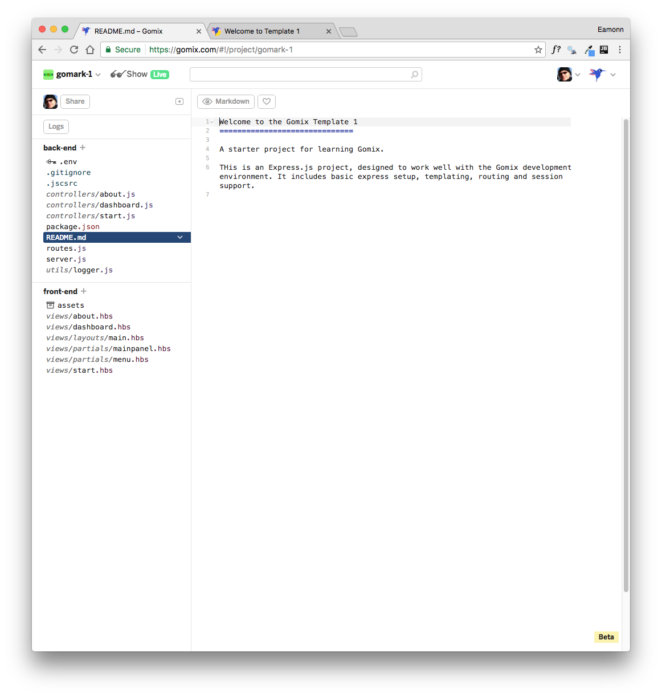
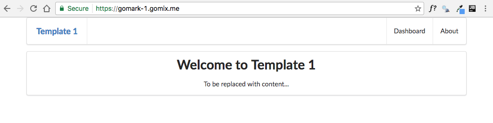
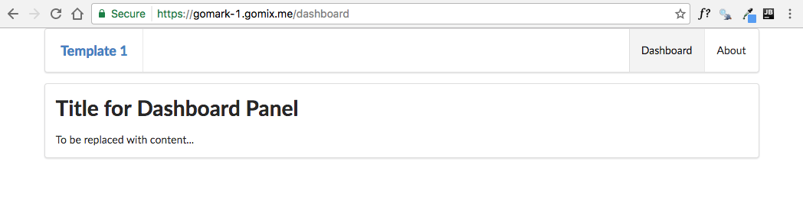
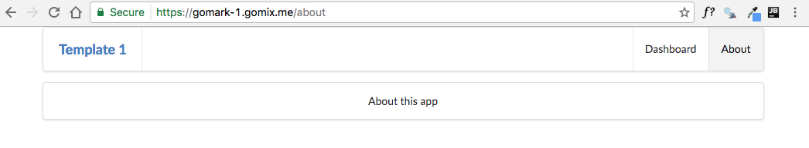

# Starter Project

In gomix, create a new project:

Keep the logs open - and view the running app:

Rename the app to something more appropriate (perhaps use your initials in the name to keep it unique):

Now, replace the project with our starter template by selecting the `Import from Github` option and importing the `edeleastar/gomix-template-1` repo:

This may take a few minutes:

Review the running app:

