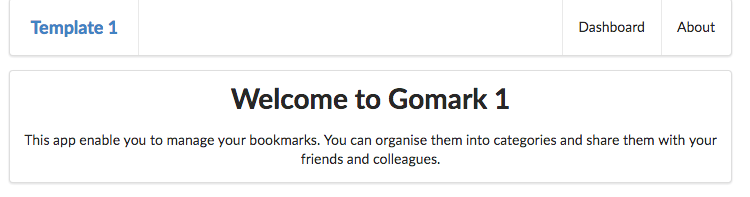

# Specification: View 1 - Welcome

> *Contains an outline of the purpose of the app in a short passage of text.*

# Solution

A simple change to the view:

## views/start.hbs

~~~
{{> menu}}

<section class="ui center aligned middle aligned segment">
  <h1 class="ui header">
    Welcome to Gomark 1
  </h1>
  

    This app enable you to manage your bookmarks. You can organise them into categories and share them with your friends and colleagues.
  

</section>
~~~

## Alternative:

Instead of entering the text in the template, we could modify the controller to pass the text to the view. This is the current start controller:

## controllers/start.js

~~~
'use strict';

const logger = require('../utils/logger');

const start = {
  index(request, response) {
    logger.info('start rendering');
    const viewData = {
      title: 'Welcome to Template 1',
    };
    response.render('start', viewData);
  },
};

module.exports = start;
~~~

Here is a revised version:

~~~
'use strict';

const logger = require('../utils/logger');

const start = {
  index(request, response) {
    logger.info('start rendering');
    const viewData = {
      title: 'Welcome to Gomark 1',
      description: 'This app enable you to manage your bookmarks. You can organise them into categories and share them with your friends and colleagues.',
    };
    response.render('start', viewData);
  },
};

module.exports = start;
~~~

Everything is the same - except we are passing two properties now:

- title
- description

Rework `start.hbs` to use these properties in the view:

## views/start.hbs

~~~
{{> menu}}

<section class="ui center aligned middle aligned segment">
  <h1 class="ui header">
    {{ title }}
  </h1>
  

    {{ description }}
  

</section>
~~~

`title` and `description` should now be rendered in the start view:

