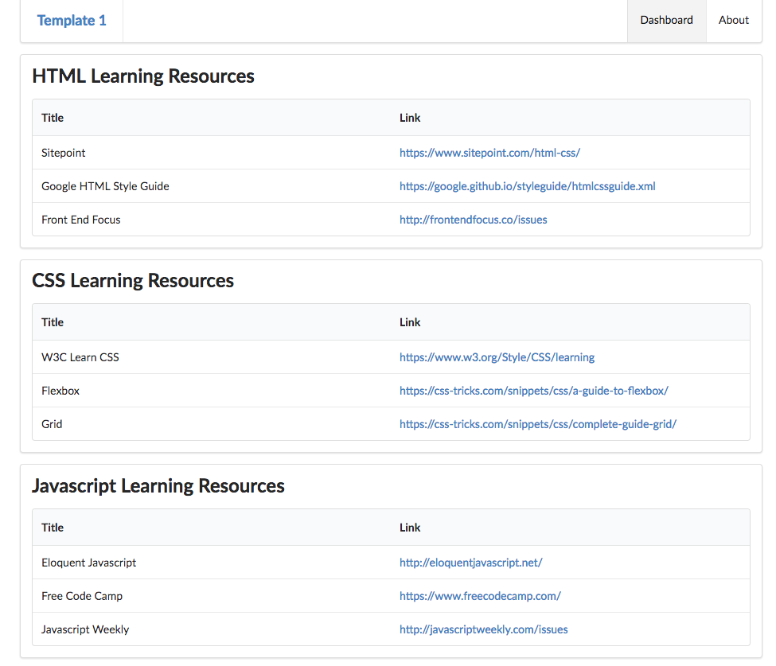

# Specification: View 2 - Bookmarks

>*A static list of bookmarks, divided into three categories:*

>- *HTML Learning Resources*
>- *CSS Learning Resources*
>- *Javascript Learning Resources*

>*Each of these contains a small set (3 or 4) of links to web sites of interest in these categories. Each link consists of:*

>- *title: an appropriate title for the link*
>- *link: the actual url for the link*

>*Clicking on the link will open the url in a new browser window*

# Solution: Static Bookmarks

We could simply revise dasbboard.hbs to include the links directly:

~~~
{{> menu id="dashboard"}}

<section class="ui segment">

  <h2 class="ui header">
    HTML Learning Resources
  </h2>
  <table class="ui fixed table">
    <thead>
    <tr>
      <th>Title</th>
      <th>Link</th>
    </tr>
    </thead>
    <tbody>
    <tr>
      <td>
        Sitepoint
      </td>
      <td>
        <a href="https://www.sitepoint.com/html-css/"> https://www.sitepoint.com/html-css/</a>
      </td>
    </tr>
    <tr>
      <td>
        Google HTML Style Guide
      </td>
      <td>
        <a href="https://google.github.io/styleguide/htmlcssguide.xml"> https://google.github.io/styleguide/htmlcssguide.xml</a>
      </td>
    </tr>
    <tr>
      <td>
        Front End Focus
      </td>
      <td>
        <a href="http://frontendfocus.co/issues"> http://frontendfocus.co/issues</a>
      </td>
    </tr>
    </tbody>
  </table>

</section>

<section class="ui segment">
  <h2 class="ui header">
    CSS Learning Resources
  </h2>
  <table class="ui fixed table">
    <thead>
    <tr>
      <th>Title</th>
      <th>Link</th>
    </tr>
    </thead>
    <tbody>
    <tr>
      <td>
        W3C Learn CSS
      </td>
      <td>
        <a href="https://www.w3.org/Style/CSS/learning"> https://www.w3.org/Style/CSS/learning</a>
      </td>
    </tr>
    <tr>
      <td>
        Flexbox
      </td>
      <td>
        <a href="https://css-tricks.com/snippets/css/a-guide-to-flexbox/"> https://css-tricks.com/snippets/css/a-guide-to-flexbox/</a>
      </td>
    </tr>
    <tr>
      <td>
        Grid
      </td>
      <td>
        <a href="https://css-tricks.com/snippets/css/complete-guide-grid/"> https://css-tricks.com/snippets/css/complete-guide-grid/</a>
      </td>
    </tr>
    </tbody>
  </table>
</section>

<section class="ui segment">
  <h2 class="ui header">
    Javascript Learning Resources
  </h2>
  <table class="ui fixed table">
    <thead>
    <tr>
      <th>Title</th>
      <th>Link</th>
    </tr>
    </thead>
    <tbody>
    <tr>
      <td>
        Eloquent Javascript
      </td>
      <td>
        <a href="http://eloquentjavascript.net/"> http://eloquentjavascript.net/</a>
      </td>
    </tr>
    <tr>
      <td>
        Free Code Camp
      </td>
      <td>
        <a href="https://www.freecodecamp.com/"> https://www.freecodecamp.com/</a>
      </td>
    </tr>
    <tr>
      <td>
        Javascript Weekly
      </td>
      <td>
        <a href="http://javascriptweekly.com/issues"> http://javascriptweekly.com/issues</a>
      </td>
    </tr>
    </tbody>
  </table>
</section>
~~~

Try this now:

