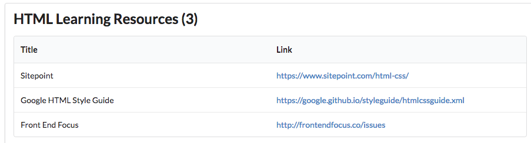

# Archive

If you want to download a complete version of the app as it should be at the end of this lab, then create a new Gomix project, and import `edeleastar/gomix-gomark-1`.

## Exercise 1: Menu

Change the menu to show 'Welcome' instead of 'Template 1'.

## Exercise 2: About View

Revise the about view such that `title` and `contact` strings are passed from the controller to the view in the `viewData` object. See step 2 in this lab for an example of how to do this.

## Exercise 2:

Show the number of bookmarks - like this:

